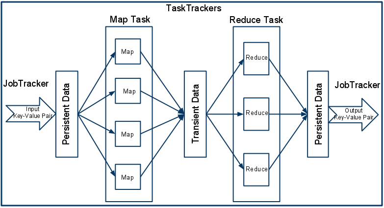

# MapNoReduce #

This project is a simplified implementation of the MapReduce middleware and programming model. MapReduce was introduced by Google in 2004 and is currently one of the most popular approaches for large scale data analytics also thanks to the availability of high quality open-source implementations (e.g., Hadoop).

When using the MapReduce paradigm, the computation takes a set of input key/value pairs, and produces a set of output key/value pairs. MapReduce users express the computation as two functions: Map and Reduce. For simplicity, in this project students will only implement the Map part of MapReduce. The Map function (different for each application), is written by the user and takes an input set of key/value pairs and produces a set of key/value pairs. In the case of MapNoReduce, the input key/value pairs are extracted from input files. The keys are the numbers of the line of the file being read and the values are the content of those lines.

The Map invocations are distributed across multiple machines by automatically partitioning the input data into a set of splits of size S. The input splits can be processed in parallel by different machines, named workers. The system should ensure that for each job submitted, all the input data is processed. Furthermore, the system should strive to ensure good performance my monitoring a job’s progress, detecting faulty or slow machines and rescheduling their tasks on idle machines.

In the original MapReduce implementation there is a centralized component, called the job tracker, that is in charge of supervising the progress of the job. In MapNoReduce, the job tracker functionalities are implemented, in a distributed manner, by the workers, that cooperate to provide the tracker’s functionalities. 

### How do I get set up? ###

* Install Visual Studio 2013
* Launch Puppet Master UI (using option -Dgui), which also launches a Puppet Master service that can take requests
* You are ready!
